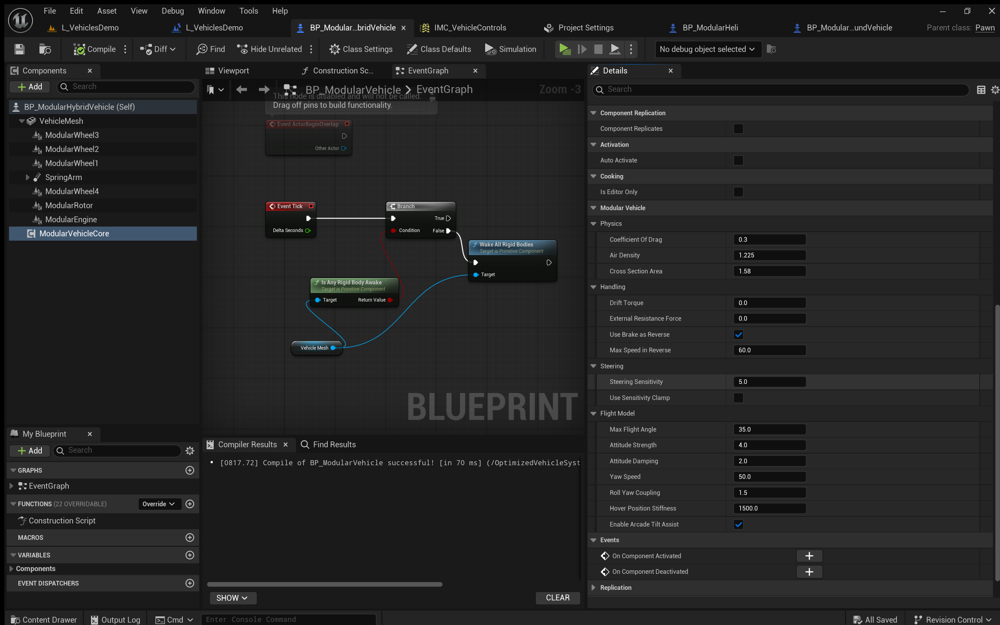
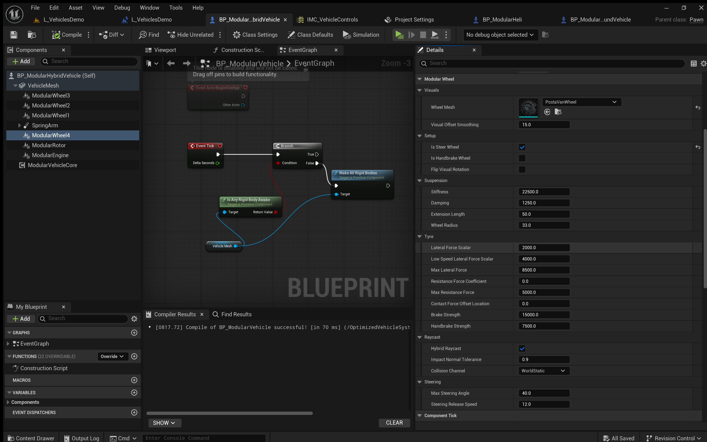
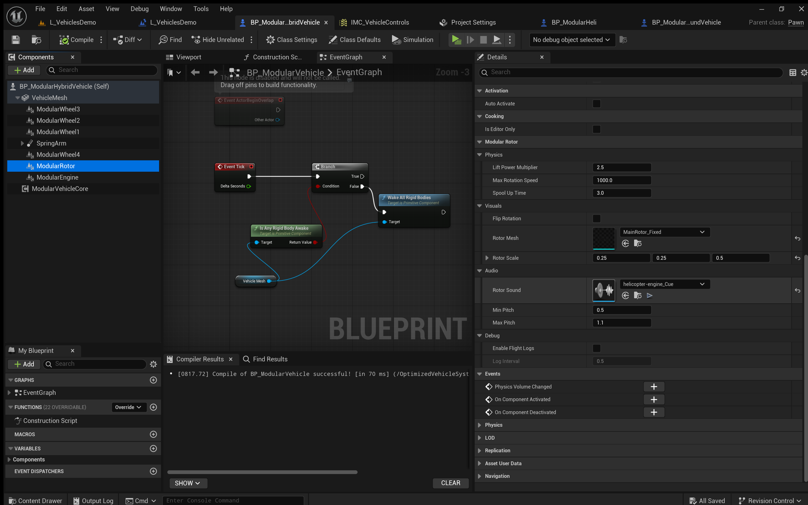

***

# OptimizedVehicleSystem - Quick Start Guide

## Overview
The **OptimizedVehicleSystem** is a high-performance, modular vehicle plugin for Unreal Engine 5. It allows you to create complex vehicles (Cars, Helicopters, and Hybrids) using **Static Meshes only**. No skeletal meshes, no rigging, and no Animation Blueprints are required.

This system runs on a custom asynchronous physics tick, offering approximately **30% better performance** than the native Chaos Vehicles plugin.

---

## 1. Project Setup

1.  Ensure the **OptimizedVehicleSystem** plugin is enabled in your project (`Edit > Plugins`).
2.  Ensure you have **Enhanced Input** enabled in your project settings (Standard for UE5).

---

## 2. Creating Your Vehicle

### Step 1: Create the Pawn
1.  In the Content Browser, right-click and create a new **Blueprint Class**.
2.  Search for and select **Pawn** (or `OptimizedTickPawn` if you plan to add custom C++ logic later).
3.  Name it (e.g., `BP_MyHybridVehicle`).

### Step 2: Setup the Body (Root)
*The system requires the physical body of the vehicle to be the Root Component.*

1.  Open your new Blueprint.
2.  Drag your vehicle body/chassis **Static Mesh** into the Components panel and make it the **Root Component** (drag it over `DefaultSceneRoot` to replace it).
3.  With the Root Static Mesh selected, look at the **Details Panel**:
    *   **Simulate Physics:** Check **TRUE**.
    *   **Collision Presets:** Ensure it is set to `PhysicsActor` or a custom profile that blocks WorldStatic/WorldDynamic.

### Step 3: Add the Core System
1.  Click **+ Add** in the Components panel.
2.  Search for `ModularVehicleCore`.
3.  Add this component to the actor.
    *   *Note:* This component acts as the "Brain" of the vehicle. It handles input, physics forces, and aggregates data from engines and wheels.

---

## 3. Assembling the Vehicle
You do not need to drag in static meshes for wheels or rotors manually. You will use the **Modular Components** to handle both the logic and the visuals.

### Adding an Engine
1.  Click **+ Add** and search for `ModularEngineComponent`.
2.  This handles torque and gear ratios.
3.  **Defaults:** The default values (Torque: 500, Max Speed: 120) are tuned to work out of the box for most vehicles.

### Adding Wheels
1.  Click **+ Add** and search for `ModularWheelComponent`.
2.  **Positioning:** Move the component in the Viewport to where you want the wheel to be (e.g., Front Left).
3.  **Visuals:**
    *   Select the `ModularWheelComponent`.
    *   In the Details Panel, look for the **Visuals** category.
    *   Assign your **Static Mesh** to the **Wheel Mesh** slot.
    *   *Optional:* If the wheel mesh is facing the wrong way, check **Flip Visual Rotation**.
4.  **Configuration:**
    *   **Is Steer Wheel:** Check this for front wheels.
    *   **Is Handbrake Wheel:** Check this for rear wheels (typically).
5.  **Repeat:** Duplicate this component for all 4 wheels (Front Right, Rear Left, Rear Right).

### Adding Rotors (For Flight/Hybrids)
*Optional: Only required if you want the vehicle to fly.*

1.  Click **+ Add** and search for `ModularRotorComponent`.
2.  **Positioning:** Move the component to the roof or wing of your vehicle.
3.  **Visuals:**
    *   In the Details Panel under **Visuals**, assign your propeller/blade **Static Mesh** to the **Rotor Mesh** slot.
4.  **Logic:** The defaults are tuned for immediate lift-off capability.

---

## 4. Input Configuration
The `ModularVehicleCore` automatically handles Enhanced Input bindings.

1.  Select the `ModularVehicleCore` component.
2.  In the Details Panel, locate the **Input Settings** category.
3.  Assign your **Input Mapping Context** (IMC).
4.  Assign your **Input Actions** (IA) for:
    *   Throttle (Float)
    *   Steering (Float)
    *   Handbrake (Bool)
    *   Vertical Thrust (Float - *For Flight*)
    *   Flight Pitch/Yaw/Roll (Float - *For Flight*)
    *   Toggle Flight Mode (Trigger - *For Hybrids*)

---

## 5. Play & Drive
1.  Drag your `BP_MyHybridVehicle` into the level.
2.  In the details panel for the Actor, ensure **Auto Possess Player** is set to `Player 0`.
3.  Press **Play**.

**The Default Experience:**
*   The vehicle will settle on its suspension immediately.
*   The engine is on by default.
*   **Driving:** Use your Throttle/Steering inputs to drive like a car.
*   **Flying:** Press your "Toggle Flight Mode" input. The rotors will spool up, and you can use Vertical Thrust to take off.

---

## Troubleshooting Tips

*   **Vehicle falls through the floor:** Ensure your Root Static Mesh has valid Simple Collision.
*   **Wheels look weird:** If your wheels are rotating around the wrong axis, adjust the **Wheel Mesh** pivot in the Static Mesh Editor, or use the `FlipVisualRotation` boolean in the component.
*   **Vehicle is too slow/fast:** Adjust the **Engine Torque** in the `ModularEngineComponent` or the **Stiffness** in the `ModularWheelComponent`.
